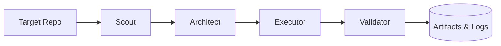

# orchestrator-core

A contract-driven orchestration framework for autonomous software engineering. Built for observability, reliability, and maintainable distributed workflows.



## Quickstart

```bash
# Clone and install
git clone https://github.com/Argenis1412/orchestrator-core.git
cd orchestrator-core
pip install -e .

# Run the scout pipeline
orchestrator run scout ./your-project
```

### Execution Output
```text
[Scout] Analyzing codebase...
[Scout] Found 3 optimization opportunities in /your-project
[Architect] Creating implementation plan...
[Executor] Applying changes...
[Validator] Code verification passed.
Artifacts saved to: ./workspace/logs/executor_20260527T170550-57248e.json
```

## What happens during execution?
Every run generates an audit trail of the entire decision-making process:
- **Artifacts:** Full code diffs and plan documents.
- **Structured Logs:** JSON-formatted events for every LLM interaction.
- **Trace IDs:** Correlation IDs tracking the pipeline state from start to finish.

## Why this architecture?
We chose a systems-engineering approach over typical LLM wrappers to ensure production-grade reliability:

- **Agents as decoupled components:** Each stage (Scout, Architect, Executor) is an independent unit, allowing for granular retries and isolated failures.
- **Contracts over Prompts:** We enforce strict schemas using Pydantic, ensuring type-safe communication between agents.
- **Observability First:** Built-in telemetry captures token usage, execution spans, and failure reasons automatically.
- **Persistence:** All execution artifacts are stored on disk, making "what happened at 3am" debuggable and reproducible.

## Non-Goals
Agent Lab is **NOT**:
- An AGI framework.
- A chatbot or conversational platform.
- A collection of loose, unverified prompts.
- A no-code automation tool.

## Development Setup

```bash
pip install -e ".[dev]"
pytest -v
ruff check src/
```

For more details, see the [full documentation](./docs/index.md).
