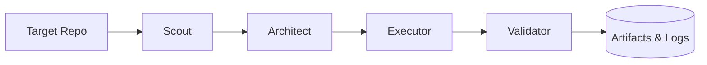

# orchestrator-core

[](https://github.com/Argenis1412/orchestrator-core/actions)
[](https://opensource.org/licenses/MIT)
[](https://www.python.org/downloads/)

A target-agnostic orchestration runtime for multi-stage software engineering workflows powered by typed contracts, execution pipelines, and structured observability.



## Quickstart

```bash
git clone https://github.com/Argenis1412/orchestrator-core.git
cd orchestrator-core
pip install -e .

orchestrator scan ./your-project
```

### Execution Artifacts

Every run produces a fully traceable artifact tree:

```
workspace/
└── run_{id}/
    ├── scout/
    │   └── findings.json
    ├── architect/
    │   └── plan.json
    ├── executor/
    │   ├── patch.diff
    │   └── executor_manifest.json
    └── validator/
        └── report.json
```

This is not simulation. These files are written to disk at every stage — debuggable, auditable, replayable.

## Execution Lifecycle

```
┌────────────────────────────────────────────────────────────┐
│  1. Scout     analyzes repository structure & hotspots     │
│  2. Architect generates typed execution plan               │
│  3. Executor  applies safe, isolated changes               │
│  4. Validator checks integrity, contracts & code quality   │
│  5. Runtime   persists artifacts, logs & traces            │
└────────────────────────────────────────────────────────────┘
```

Every stage receives a typed contract (Pydantic schema) and produces a typed contract. The pipeline fails fast on schema mismatch, not at runtime.

## Why this architecture?

Most "agent frameworks" are prompt wrappers with marketing. This is an orchestration engine built for production:

- **Decoupled agents** — Each stage is an independent unit with isolated failure boundaries. If the Executor crashes, the re-run resumes from the last checkpoint.
- **Contracts over prompts** — Communication between stages is enforced via Pydantic schemas. No silent JSON parsing failures, no hallucinated keys.
- **Observability first** — Every LLM call is logged with trace ID, token usage, latency, and cost. Every stage duration is tracked.
- **Artifact persistence** — All intermediate outputs are written to disk. Debugging "why did the Executor do that at 3am?" is a file read away.
- **CI/CD mindset** — Pipelines are deterministic, resumable, and testable. Same inputs produce the same audit trail.

## Non-Goals

orchestrator-core is **NOT**:
- An AGI framework
- A chatbot or conversational platform
- A collection of loose prompts
- A no-code automation tool
- A vector database or RAG system
- Browser automation

## Repository Structure

```
src/
└── orchestrator/
    ├── main.py          # CLI entry point
    ├── pipeline.py      # Pipeline execution engine
    ├── agents/          # Scout, Architect, Executor, Validator
    ├── schemas/         # Typed contracts (Pydantic models)
    ├── clients/         # LLM provider clients
    └── observability/   # Structured logging & telemetry
tests/
docs/
```

## Development

```bash
pip install -e ".[dev]"
pytest -v
ruff check src/
```

For more details, see the [documentation](./docs/index.md).
